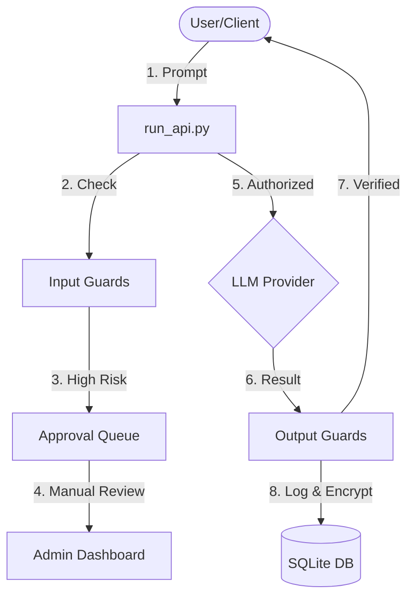

# 🛡️ LLM Security Gateway Pro

An enterprise-grade security proxy designed to monitor, filter, and govern interactions between internal users and Large Language Models (LLMs) like Groq and Ollama. This project implements advanced guardrails and a modern administrative dashboard to ensure safe and compliant AI adoption.

## 🚀 Features

- **Advanced Security Guardrails**:
    - **Prompt Injection Detection**: Identifies system override attempts and malicious instructions.
    - **PII Leakage Prevention**: Automatically detects sensitive data (Emails, SSNs, Credit Cards).
    - **Harmful Content Filtering**: Classifies and blocks violent, hateful, or sensitive outputs.
- **Human-in-the-Loop (HITL)**: Automatically queues high-risk requests for manual administrative approval.
- **Intelligence Analytics Dashboard**: Premium Streamlit UI featuring:
    - Real-time traffic monitoring and token expenditure tracking.
    - Model distribution analytics and security posture breakdowns.
    - Searchable history with end-to-end encrypted log viewing.
- **Modular Enterprise Architecture**: Professional directory structure for high maintainability and scalability.

## 🏗️ Architecture



## 📂 Project Structure

- **`app/`**: Service layer containing the FastAPI server and Streamlit UI logic.
- **`core/`**: Domain layer for security logic, LLM adapters, and cryptographic handlers.
- **`data/`**: Data persistence layer with SQLite repository patterns.
- **`utils/`**: Shared infrastructure utilities.
- **`run_api.py`**: Entrance for the Security Proxy.
- **`run_dashboard.py`**: Entrance for the Analytics UI.
- **`client.py`**: Developer CLI for testing interactions.

## 🛠️ Setup & Installation

1. **Clone the repository**:
   ```bash
   git clone https://github.com/yourusername/llm-gateway-pro.git
   cd llm-gateway-pro
   ```

2. **Install Dependencies**:
   ```bash
   pip install -r requirements.txt
   ```

3. **Configure Environment Variables**:
   Copy the example template:
   ```bash
   cp .env.example .env
   ```
   Now, configure your `.env` with the following:

   - **LLM API Key**: Get your free API key from [Groq Cloud Console](https://console.groq.com/keys).
   - **Encryption Key**: This project uses Fernet encryption for logs. Generate a new key by running this in your Python terminal:
     ```python
     from cryptography.fernet import Fernet
     print(Fernet.generate_key().decode())
     ```
   - **Secret Key**: Any long random string for application security.

4. **Network Configuration (Optional)**:
   By default, the gateway runs on `127.0.0.1`. To access it from other devices in your network:
   - Find your local IP address by running `ipconfig` in your terminal and looking for the **IPv4 Address** (e.g., `192.168.x.x`).
   - Update `API_HOST` in your `.env` with this IP.
   - Update `SERVER_URL` in `client.py` to match.

5. **Launch the System**:
   Open two terminal windows:
   - **Terminal 1**: `python run_api.py` (Starts the Gateway)
   - **Terminal 2**: `python run_dashboard.py` (Starts the Analytics UI)

6. **Test the Client**:
   ```bash
   python client.py
   ```

## 🔒 Security Note
This project uses **Fernet AES encryption** to protect user logs and sensitive responses in the database, ensuring privacy and compliance even at rest.
