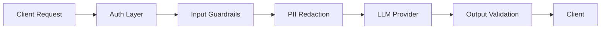

# LLM Security Gateway

A robust, middleware-based security layer designed to sit between users and Large Language Models (LLMs). This gateway ensures safe, compliant, and cost-effective AI interactions by intercepting requests and responses to mitigate common LLM vulnerabilities.

## 🚀 Key Features

* **Prompt Injection Defense:** Real-time scanning of incoming prompts to detect and block adversarial injection attempts.
* **PII Detection:** Automatically identifies Personally Identifiable Information (PII) to assess interaction risk.
* **Sensitive Content Filtering:** Blocks toxic, harmful, or non-compliant content in both prompts and model completions.
* **Audit Logging:** Detailed logging of all interactions (with latency and cost tracking) for compliance and monitoring.
* **Multi-Provider Support:** Integration with Groq and local models (via Ollama).

## 🛠️ Tech Stack

* **Language:** Python 3.10+
* **Framework:** FastAPI (High performance, asynchronous)
* **Validation:** Pydantic V2
* **Security:** Regular expression engines & Pre-trained NLP classifiers
* **Containerization:** Docker & Docker Compose

## 📦 Installation

1. **Clone the repository:**
```bash
git clone https://github.com/mayank2004201/llm-security-gateway.git
cd llm-security-gateway
```

2. **Set up Environment Variables:**
Create a `.env` file in the root directory:
```env
OPENAI_API_KEY=your_key_here
GATEWAY_AUTH_TOKEN=your_secure_token
LOG_LEVEL=INFO
```

3. **Run with Docker:**
```bash
docker build -t llm-security-gateway .
docker run -p 8000:8000 llm-security-gateway
```

## 🖥️ Usage

Route your LLM requests through the gateway's endpoint:

```bash
curl -X POST "http://localhost:8000/v1/chat/completions" \
     -H "Authorization: Bearer your_secure_token" \
     -H "Content-Type: application/json" \
     -d '{
           "model": "gpt-4",
           "messages": [{"role": "user", "content": "Tell me a joke about security."}]
         }'
```

## 🛡️ Security Layers

1. **Input Sanitization:** Removes hidden characters and escape sequences.
2. **Pattern Matching:** Detects "jailbreak" keywords and malicious prompt structures.
3. **Output Guardrails:** Validates that the model's response adheres to defined safety constraints.

## 🧠 Core Concepts & Implementation

The **LLM Security Gateway** is built on the principle of **Defense-in-Depth**. It implements several industry-standard security patterns to ensure LLM reliability and safety.

### 🛡️ 1. Input Guardrails (Prompt Shielding)

Before a request reaches the LLM, it passes through multiple "Guardrails" to detect malicious intent.

* **Prompt Injection Detection:** We use a combination of **Heuristic Analysis** (keyword blacklisting like "ignore previous instructions") and **Semantic Analysis** to identify attempts to bypass system prompts.
* **Jailbreak Mitigation:** Filters designed to catch common jailbreak techniques (e.g., "DAN" or "Payload Splitting").

### 🔒 2. Data Privacy & PII Detection

To ensure awareness of data privacy, the gateway scans outgoing prompts for sensitive information.

* **Regex-based Scanning:** Identification of patterns like Credit Card numbers, SSNs, and Emails.
* **Risk Assessment:** PII detection contributes to an overall safety score, which can trigger admin approval workflows.

### 🚦 3. Operational Middleware

Beyond security, the gateway manages interaction efficiency:

* **Latency Tracking:** Real-time monitoring of LLM response times.
* **Cost Estimation:** Metadata extraction to track token usage and estimated costs per session.

### 📊 4. Observability & Audit Trails

* **Semantic Logging:** We log not just the raw text, but the *intent* and *safety score* of every interaction.
* **Cost Tracking:** Metadata is extracted from LLM responses to track token usage per user/session in real-time.

## 🛠️ Implementation Detail: The Gateway Flow



1. **Auth Layer:** Validates the `GATEWAY_AUTH_TOKEN`.
2. **Input Guardrails:** Scans for prompt injections.
3. **PII Redaction:** Masks sensitive data.
4. **LLM Provider:** Securely calls the external/internal API.
5. **Output Validation:** Ensures the model didn't hallucinate or leak internal system prompts in its response.

## 📂 Project Structure

This repository follows a modular architecture to separate security logic, API routing, and LLM provider integrations.

```text
llm-security-gateway/
├── app/                        # Web application and API
│   ├── api/                    # API route definitions & schemas
│   │   ├── routes.py           # Main endpoints (chat, completions)
│   │   └── schemas.py          # Pydantic models
│   ├── server.py               # FastAPI application entry point
│   └── static/                 # Frontend assets (dashboard)
├── core/                       # Core system logic
│   ├── config.py               # Environment variables & settings
│   ├── crypto.py               # Security utilities
│   ├── llm/                    # LLM Service clients (Groq, Ollama)
│   └── security/               # Guardrails (Input/Output scanning)
├── data/                       # Data persistence layer
│   ├── database.py             # SQLite initialization
│   └── repository.py           # Database operations
├── Dockerfile                  # Container instructions
├── requirements.txt            # Dependencies
└── README.md                   # Project documentation
```

### 🧱 Key Component Breakdown

* **`core/security/`**: Contains the logic for scanning prompts and responses against safety patterns.
* **`core/llm/`**: Houses the clients for interacting with different model providers.
* **`app/api/routes.py`**: Orchestrates the flow from request to guardrail to LLM and back.

## 📈 Roadmap

* [ ] Integration with LangChain/LlamaIndex.
* [ ] Semantic caching to reduce costs.
* [ ] Dashboard for real-time security metrics.

## 📄 License

Distributed under the MIT License. See `LICENSE` for more information.

---

*Developed by [Anshul Goel](https://github.com/mayank2004201)*
